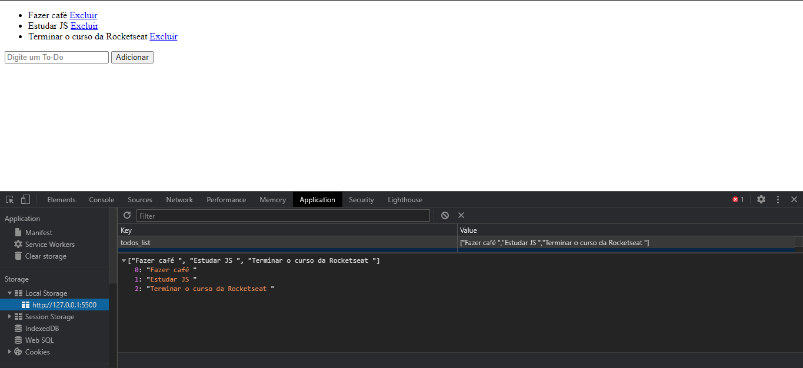

# Exercícios JS Rocketseat

## Exercícios feitos no curso de JS da Rocketseat
<h6 align="center"><a href="https://app.rocketseat.com.br/node/curso-java-script">Curso<a><h6>

<p align="center">
 <a href="#modulo1">Módulo 1</a> •
 <a href="#modulo2">Módulo 2</a> • 
 <a href="#modulo3">Módulo 3</a> • 
 <a href="#modulo4">Módulo 4</a> 
</p>

<span id="modulo1"><span>

## Módulo 1
#### Introdução Javascript

### Exercício 1

Crie uma função que dado o objeto a seguir:

~~~javascript
var endereco = {
 rua: "Rua dos pinheiros",
 numero: 1293,
 bairro: "Centro",
 cidade: "São Paulo",
 uf: "SP"
};
~~~

Retorne o seguinte conteúdo:

```
O usuário mora em São Paulo / SP, no bairro Centro, na rua "Rua dos Pinheiros" com
nº 1293.
```

### Exercício 2

Crie uma função que dado um intervalo (entre x e y) exiba todos os número pares:

~~~javascript
function pares(x, y) {
 // código aqui
}
pares(32, 321);
~~~

### Exercício 3

Escreva uma função que verifique se o vetor de habilidades passado possui a habilidade "Javascript"
e retorna um booleano true/false caso exista ou não.

~~~javascript
function temHabilidade(skills) {
 // código aqui
}

var skills = ["Javascript", "ReactJS", "React Native"];
temHabilidade(skills); // true ou false
~~~

###### *Dica: para verificar se um vetor contém um valor, utilize o método indexOf()*

### Exercício 4

Escreva uma função que dado um total de anos de estudo retorna o quão experiente o usuário é:

~~~javascript
function experiencia(anos) {
 // código aqui
}

var anosEstudo = 7;
experiencia(anosEstudo);

// De 0-1 ano: Iniciante
// De 1-3 anos: Intermediário
// De 3-6 anos: Avançado
// De 7 acima: Jedi Master
~~~

### Exercício 5

Dado o seguinte vetor de objetos:

~~~javascript
var usuarios = [
 {
 nome: "Diego",
 habilidades: ["Javascript", "ReactJS", "Redux"]
 },
 {
 nome: "Gabriel",
 habilidades: ["VueJS", "Ruby on Rails", "Elixir"]
 }
];
~~~

Escreva uma função que produza o seguinte resultado:

```
O Diego possui as habilidades: Javascript, ReactJS, Redux
O Gabriel possui as habilidades: VueJS, Ruby on Rails, Elixir
```

###### *Dica: Para percorrer um vetor você deve utilizar a sintaxe for...of e para unir valores de um array com um separador utilize o join.*

<span id="modulo2"><span>

## Módulo 2
#### Manipulando a DOM

### Exercício 1

Crie um botão que ao ser clicado cria um novo elemento em tela com a forma de um quadrado
vermelho com 100px de altura e largura. Sempre que o botão for clicado um novo quadrado deve
aparecer na tela.

### Exercício 2

Utilizando o resultado do primeiro desafio, toda vez que o usuário passar o mouse por cima de
algum quadrado troque sua cor para uma cor aleatória gerada pela função abaixo:

~~~javascript
function getRandomColor() {
 var letters = "0123456789ABCDEF";
 var color = "#";
 for (var i = 0; i < 6; i++) {
    color += letters[Math.floor(Math.random() * 16)];
 }
 return color;
}

var newColor = getRandomColor(); // #E943F0
~~~

### Exercício 3

A partir do seguinte vetor:
var nomes = ["Diego", "Gabriel", "Lucas"];
Preencha uma lista (*`<ul>`*) no HTML com os itens da seguinte forma:

~~~html
<ul> 
    <li>Diego
    <li>Gabriel
    <li>Lucas
</ul>
~~~

### Exercício 4

Seguindo o resultado do exercício anterior adicione um input em tela e um botão como a seguir:

~~~javascript
<input type="text" name="nome">
<button onClick="adicionar()">Adicionar</button>
~~~

Ao clicar no botão, a função adicionar() deve ser disparada adicionando um novo item a lista de
nomes baseado no nome preenchido no input e renderizando o novo item em tela juntos aos
demais itens anteriores. Além disso, o conteúdo do input deve ser apagado após o clique.

<span id="modulo3"><span>

## Módulo 3
#### App de To-do's

### Aplicação

Aplicação que permite a adição, visualização e exclusão de elementos de uma lista (*todos_list*), assim como o armazenamento de tais elementos no *local storage* do usuário.



<span id="modulo4"><span>

## Módulo 4
#### JS assíncrono

### Exercício 1

Crie uma função que recebe a idade de um usuário e retorna uma Promise que depois de 2
segundos retornará se usuário é maior ou não que 18 anos. Se o usuário ter mais que 18 anos de
idade o resultado deve cair no .then, caso contrário, no .catch

~~~javascript
function checaIdade(idade) {
 // Retornar uma promise
}
checaIdade(20)
 .then(function() {
 console.log("Maior que 18");
 })
 .catch(function() {
 console.log("Menor que 18");
 });
~~~

### Exercício 2

Crie uma tela com um `<input>` que deve receber o nome de um usuário no Github. Após digitar o
nome do usuário e clicar no botão buscar a aplicação deve buscar pela API do Github (conforme
URL abaixo) os dados de repositórios do usuário e mostrá-los em tela:

URL de exemplo: *https://api.github.com/users/diego3g/repos*

Basta alterar "diego3g" pelo nome do usuário.

~~~javascript
<input type="text" name="user">
<button onclick="">Adicionar</button>
~~~

Depois de preencher o input e adicionar, a seguinte lista deve aparecer abaixo:

~~~html
<ul>
 <li>repo1</li>
 <li>repo2</li>
 <li>repo3</li>
 <li>repo4</li>
 <li>repo5</li>
</ul>
~~~

### Exercício 3

A partir do resultado do exemplo anterior adicione um indicador de carregamento em tela no lugar
da lista apenas enquanto a requisição estiver acontecendo:

~~~html
<li>Carregando...</li>
~~~

Além disso, adicione uma mensagem de erro em tela caso o usuário no Github não exista.

###### Dica: Quando o usuário não existe, a requisição irá cair no .catch com código de erro 404.

### Exercício 3 alterado

Com o resultado do exercício anterior, adicionei na aplicação a possibilidade de limpar a pesquisa, ao clicar em uma tag `<a>` a e o texto de *noResults*, que aparece quando o usuário pesquisado não é encontrado.

#### Código adicionado

~~~javascript
...

const listElement = document.querySelector("#app ul")

...

function cleanQuery() {
    listElement.innerHTML = ""
}

...

function userQuery() {
    ...

    return axios.get(...)
    .then(response => {
        ...
    })
    .catch(error => {
        ...
        const noResult = document.createElement("li")
        const noResultContent = document.createTextNode("Nenhum resultado encontrado!")

        noResult.appendChild(noResultContent)
        listElement.appendChild(noResult)
        ...
    })
}
~~~